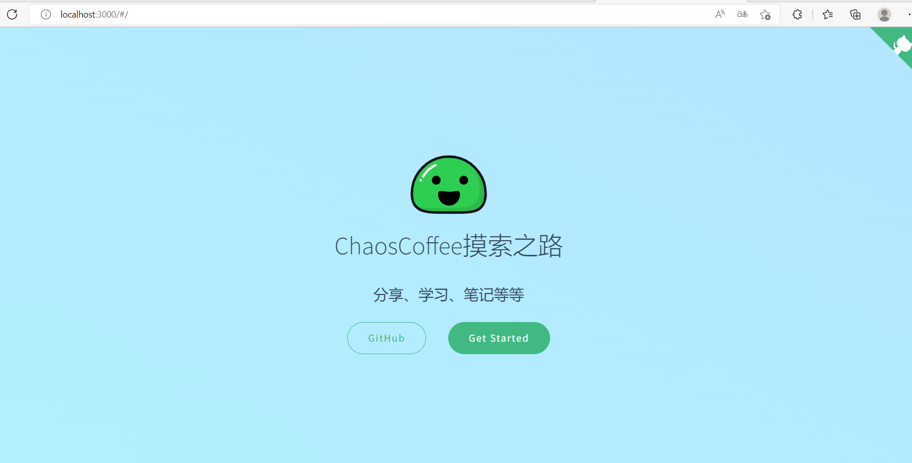

# 搭建博客

*官方文档*  

> https://docsify.js.org/#/zh-cn/quickstart

## 安装

```js
npm i docsify-cli -g
```

## 初始化

```js
docsify init ./docs
```

## 部署
```js
docsify serve docs
```

## 打开浏览器

运行日志如下
```
> Serving E:\github\ChaosCoffee.github.io\docs now.  

> Listening at http://localhost:3000

```
